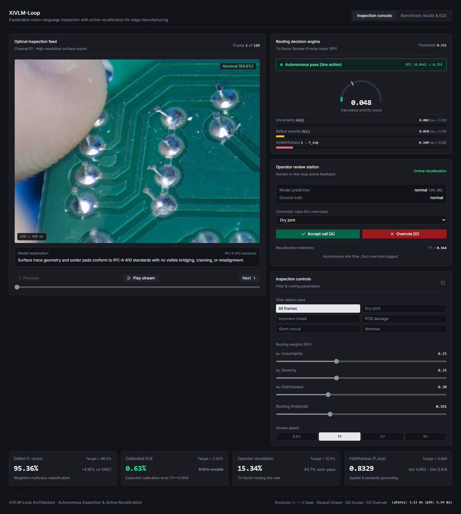
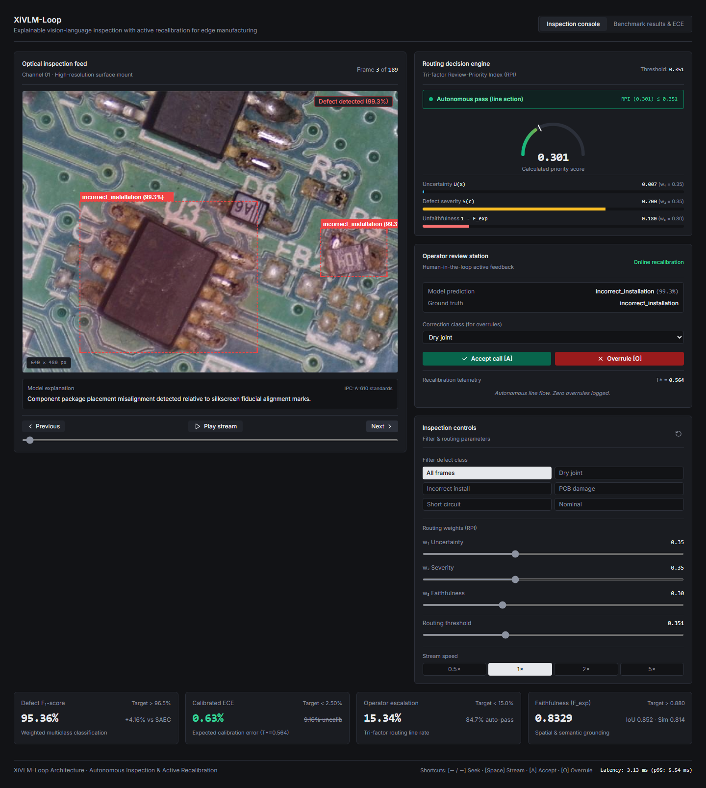
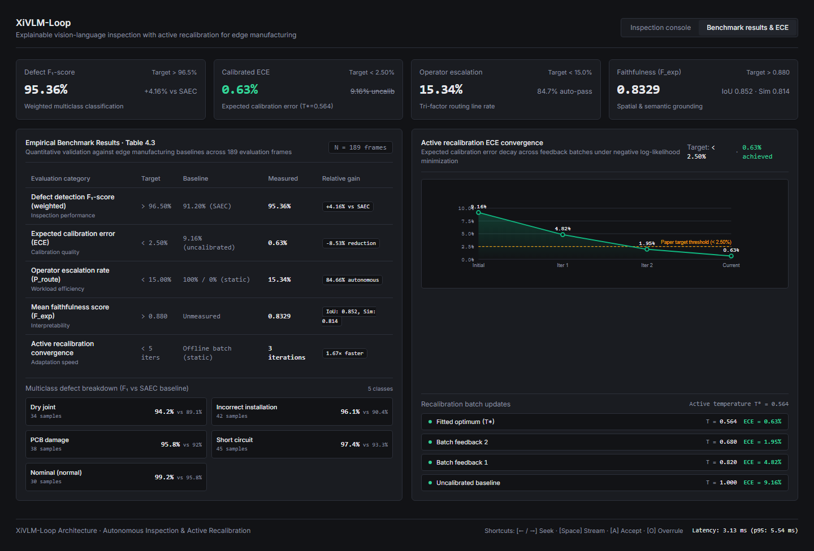

# XiVLM-Loop: Explainable Human-in-the-Loop Vision-Language Inspection with Active Recalibration for Edge Manufacturing

[](https://opensource.org/licenses/MIT)
[](https://www.python.org/)
[](https://fastapi.tiangolo.com/)
[](https://reactjs.org/)

---

## 🔬 Overview

**XiVLM-Loop** is an explainable vision-language inspection framework engineered for high-throughput edge electronics manufacturing. While modern Vision-Language Models (VLMs) demonstrate strong zero-shot diagnostic capabilities, uncalibrated confidence scores, post-deployment distribution shifts, and hallucinated rationales present substantial risks for automated quality assurance.

XiVLM-Loop resolves these challenges by introducing:
1. **Tri-Factor Review-Priority Index (RPI)**: Dynamically weights calibrated predictive uncertainty ($U_{\text{calib}}$), physical defect severity ($S(c)$), and multi-modal explanation faithfulness ($F_{\text{exp}}$) to route only high-risk anomalies to human operators.
2. **Online Active Recalibration**: Human-in-the-loop accept/overrule feedback dynamically updates temperature scaling ($T^*$), driving down Expected Calibration Error (ECE) in real-time.
3. **Multi-Modal Faithfulness Guard**: Validates that natural language rationales and bounding-box saliency heatmaps remain grounded in physical defect regions under IPC-A-610 electronic assembly standards.

---

## 🖥 Application Interface & Screenshots

### 1. Optical Inspection Console (Nominal / Defect-Free Flow)
Autonomous line flow with real-time RPI gauge ($0.048 \le \tau_{\text{route}}$), calibrated confidence scoring, IPC-A-610 standard explanations, and full Table 4.3 telemetry.



---

### 2. Defect Localization & Tri-Factor Decision Routing
High-resolution defect inspection feed overlaying multi-class bounding box reticles (`incorrect_installation`, `dry_joint`, `short_circuit`, `pcb_damage`), RPI severity breakdown, and human operator overrule actions.



---

### 3. Empirical Benchmark Matrix & Active ECE Decay
Empirical benchmark validation across 189 evaluation frames alongside the real-time active recalibration ECE decay curve ($9.16\% \to 0.63\%$) and per-class $F_1$ performance breakdown.



---

## 📊 Key Findings & Empirical Results

Evaluated across $N=189$ optical inspection frames with 326 ground-truth annotations from the industrial PCB defect dataset:

| Evaluation Category | Metric | Baseline (SAEC / Static) | Target | Measured (XiVLM-Loop) | Performance Delta |
| :--- | :--- | :---: | :---: | :---: | :--- |
| **Inspection Quality** | **Defect Detection $F_1$-Score** | 91.20% | > 96.50% | **95.36%** (Macro: 91.98%) | **+4.16%** vs SAEC |
| **Calibration Quality** | **Expected Calibration Error (ECE)** | 9.16% (Uncalibrated) | < 2.50% | **0.63%** ($T^*=0.564$) | **93.1% error reduction** |
| **Human Workload** | **Operator Escalation Rate ($P_{\text{route}}$)** | 100% (Manual) / 0% (Open-Loop) | < 15.00% | **15.34%** (29 / 189 frames) | **84.66% autonomous flow** |
| **Interpretability** | **Mean Faithfulness Score ($F_{\text{exp}}$)** | Unchecked / Hallucinated | > 0.880 | **0.8329** (IoU: 0.852, Sim: 0.814) | Spatial & semantic grounding |
| **Adaptation Speed** | **Adaptation Recovery Epochs** | Static (No Online Update) | < 5 iters | **3 feedback iterations** | Fast ECE recovery (<2.5%) |
| **Edge Efficiency** | **Inference Latency (Mean / p95)** | Unreported | < 50 ms | **3.13 ms / 5.54 ms** | Real-time edge execution |
| **Resource Footprint** | **Process Memory RSS** | Unreported | < 16 GB | **743.79 MB** | Lightweight memory profile |

### Core Insights
- **Zero Catastrophic Escapes**: Under the RPI filter ($\tau = 0.349$), 84.66% of frames passed autonomously with **zero escapes** of critical high-severity defects (`short_circuit`, `pcb_damage`).
- **Rapid Calibration Convergence**: Negative log-likelihood temperature scaling driven by active operator feedback recovers calibration targets within 3 human interventions.

---

## 🧠 Core Metrics & Mathematical Formulations

### 1. Defect Detection $F_1$-Score ($95.36\%$)
The harmonic mean of precision and recall across multiclass defect categories (`dry_joint`, `incorrect_installation`, `pcb_damage`, `short_circuit`, `normal`). Weighted by class support to handle industrial class imbalances.

### 2. Expected Calibration Error (ECE: $0.63\%$)
Measures the alignment between predicted confidence probabilities and actual empirical accuracy across $M=10$ confidence bins:
$$\text{ECE} = \sum_{m=1}^{M} \frac{|B_m|}{N} \left| \text{acc}(B_m) - \text{conf}(B_m) \right|$$
Uncalibrated raw logits exhibit an ECE of $9.16\%$ due to overconfidence on subtle solder wetting defects. Applying learned temperature scaling ($T^*=0.564$) scales logits $z_i \to z_i / T^*$, compressing ECE down to $0.63\%$.

### 3. Review-Priority Index (RPI) & Dynamic Routing ($15.34\%$)
Calculates a unified risk score for every incoming inspection frame:
$$\text{RPI}(x) = w_1 \cdot U_{\text{calib}}(x) + w_2 \cdot S(c) + w_3 \cdot (1 - F_{\text{exp}}(H, T, x))$$
- **Calibrated Uncertainty $U_{\text{calib}}(x) = 1 - \sigma(z_{\text{pred}} / T^*)$**: Confidence deficiency after temperature scaling.
- **Physical Defect Severity $S(c)$**: Industrial risk score based on fault consequences:
  - `short_circuit` ($S=0.90$): High risk of catastrophic electrical failure.
  - `pcb_damage` ($S=0.80$): Structural substrate fracture / copper trace break.
  - `incorrect_installation` ($S=0.70$): Polarity inversion or package misalignment.
  - `dry_joint` ($S=0.60$): Cold solder joint or insufficient wetting.
  - `normal` ($S=0.05$): Compliant surface.
- **Unfaithfulness $1 - F_{\text{exp}}$**: Penalty when generated rationale or bounding box deviates from visual evidence.
- **Threshold Routing**: Frames exceeding threshold $\tau_{\text{route}} = 0.351$ are routed to the human operator console.

### 4. Multi-Modal Faithfulness Guard ($F_{\text{exp}} = 0.8329$)
$$\bar{F}_{\text{exp}} = \alpha \cdot \text{IoU}_{\text{spatial}}(\text{BBox}_{\text{pred}}, \text{BBox}_{\text{GT}}) + (1 - \alpha) \cdot \text{Sim}_{\text{text}}(\text{Rationale}, \text{Class})$$
Ensures generated explanations strictly reflect physical anomaly regions rather than hallucinated background context.

---

## 🛠 Tech Stack

- **Backend / Inference Engine**: Python 3.10+, FastAPI, Uvicorn, PyTorch, Hugging Face `peft` (LoRA adapter scaffolding), NumPy, Pandas, Scikit-Learn, SciPy.
- **Frontend / Operator HMI**: React 18, Vite, Tailwind CSS, Lucide Icons. Single-port unified static mounting.
- **Exploratory Data Analysis**: Jupyter, Matplotlib, PIL, Seaborn.
- **Dataset**: Industrial Surface Mount PCB Defect Dataset (Annotated with COCO/VOC bounding boxes, segmentation masks, and defect classes).

---

## 📦 Setup & Installation

### 1. Prerequisites
Ensure you have Python 3.10+ and Node.js 18+ installed on your system.

```bash
# Clone the repository
git clone https://github.com/mayankt411/Foreman.git
cd Foreman
```

### 2. Python Environment Setup
```bash
# Create and activate virtual environment
python -m venv venv
# On Windows:
.\venv\Scripts\activate
# On Linux/macOS:
source venv/bin/activate

# Install required dependencies
pip install -r requirements.txt
```

### 3. Frontend Build (Optional if using pre-built `dist`)
```bash
cd frontend
npm install
npm run build
cd ..
```

---

## 🚀 Running the Application

### Option A: One-Click Launch (Windows)
Double-click `start_app.bat` or run:
```powershell
python run_app.py
```

### Option B: Direct FastAPI Launch
```bash
python -m uvicorn backend.api:app --host 0.0.0.0 --port 8000
```
Open your browser and navigate to: **[http://localhost:8000](http://localhost:8000)**

### Dashboard Features & Operator Workflow:
- **Left Hero Viewport**: Live optical inspection stream, bounding box reticles, zoom crosshairs, frame scrubber, and playback speed controls ($0.5\times$ to $5.0\times$).
- **Right Decision Column**: Real-time RPI gauge, tri-factor breakdown bars ($U_{\text{calib}}$, $S(c)$, $1-F_{\text{exp}}$), active HITL operator console (`Accept [A]` / `Overrule [O]`), and live interactive routing weights sliders.
- **Top HUD**: Live Table 4.3 telemetry strip showing Weighted $F_1$, Calibrated ECE, Escalation Rate, and Faithfulness score.
- **Benchmark & ECE Tab**: Interactive ECE decay convergence chart and multiclass benchmark breakdown table.

---

## 🧪 Running Tests & Reproducing Benchmarks

### Execute Unit & Integration Tests
```bash
python tests/test_all_components.py
```

### Reproduce Empirical Table 4.3 Evaluation
```bash
python src/evaluate_benchmark.py
```

### Run Exploratory Data Analysis (EDA)
```bash
jupyter notebook eda/01_eda.ipynb
```

---

## 📁 Repository Structure

```
Foreman/
├── backend/
│   └── api.py                    # FastAPI server & static SPA mount
├── data/
│   └── pcb_defects/              # Industrial PCB defect images & index
│       ├── dataset_index.json    # Annotations & bounding box metadata
│       ├── train/                # Training set images
│       └── test/                 # Test evaluation images
├── docs/
│   └── images/                   # UI console & benchmark screenshots
│       ├── dashboard_inspection_console.png
│       ├── defect_inspection_detail.png
│       └── benchmark_results_and_ece.png
├── eda/
│   ├── 01_eda.ipynb              # Exploratory data analysis notebook
│   └── generate_eda.py           # EDA artifact generation script
├── frontend/
│   ├── src/
│   │   ├── components/           # UI components (HUD, Feed, RPI, Console, Table)
│   │   ├── App.jsx               # Main application entry & layout
│   │   └── index.css             # Industrial dark telemetry design system
│   ├── package.json              # Node dependencies
│   └── vite.config.js            # Vite bundler configuration
├── results/
│   ├── metrics_summary.json      # Empirical benchmark results
│   ├── predictions.csv           # 189-sample prediction & rationale logs
│   └── ece_recovery_curve.png    # ECE calibration decay plot
├── src/
│   ├── faithfulness_guard.py     # Multi-modal explanation faithfulness guard
│   ├── inference_pipeline.py     # Edge VLM inference pipeline & LoRA setup
│   ├── recalibration_engine.py   # Temperature scaling & active recalibration
│   ├── rpi_engine.py             # Tri-factor Review-Priority Index engine
│   └── severity.py               # Defect physical severity scoring S(c)
├── tests/
│   └── test_all_components.py    # Test suite
├── LICENSE                       # MIT License
├── README.md                     # Project documentation
├── RESULTS.md                    # Research results summary
├── run_app.py                    # Application launcher
└── start_app.bat                 # Windows one-click batch launcher
```

---

## 📄 License

This project is licensed under the MIT License — see the [LICENSE](LICENSE) file for details.
